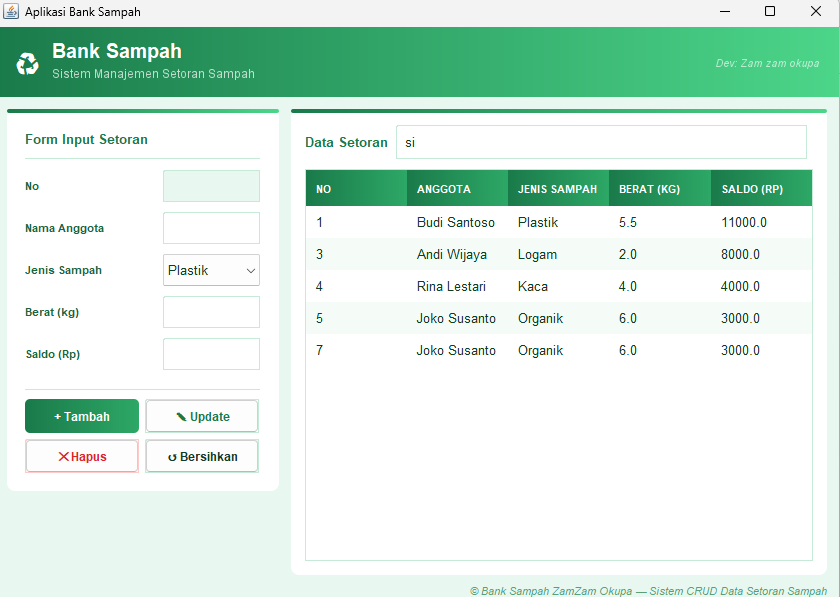
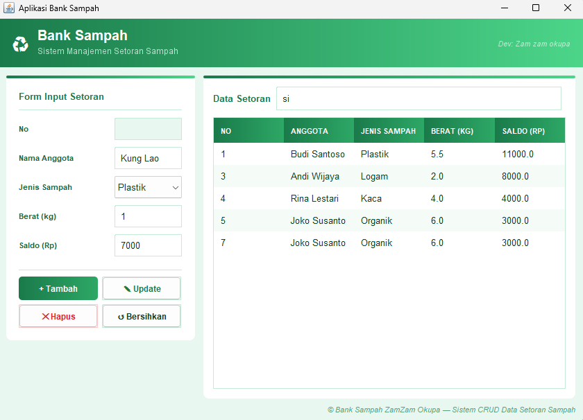
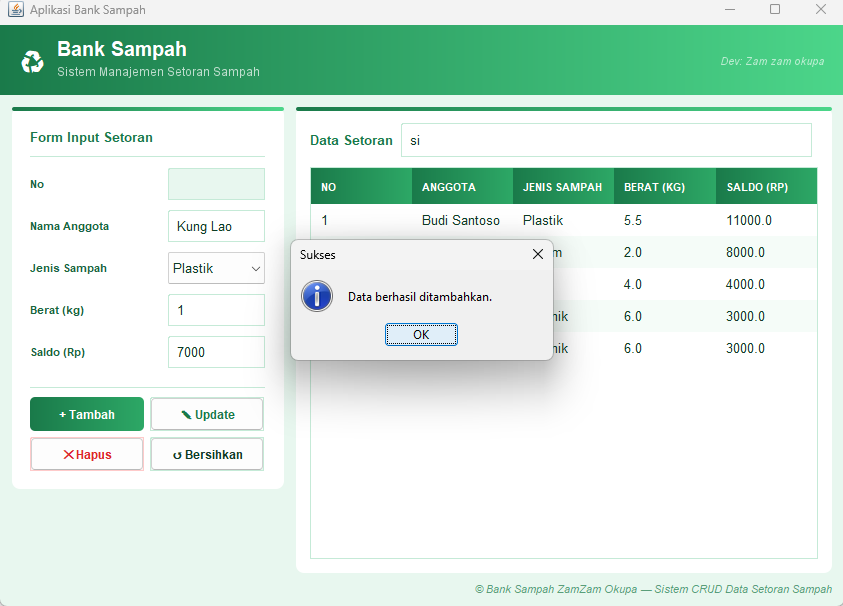
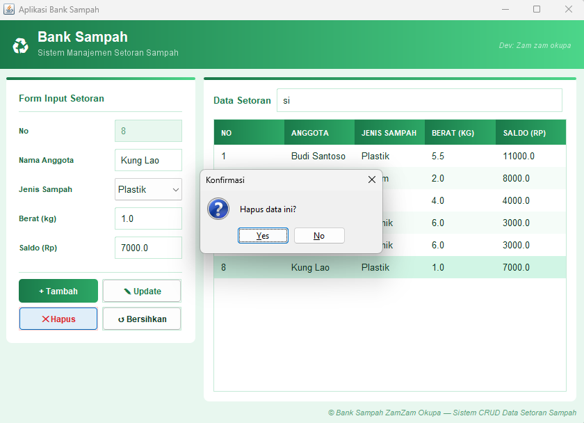
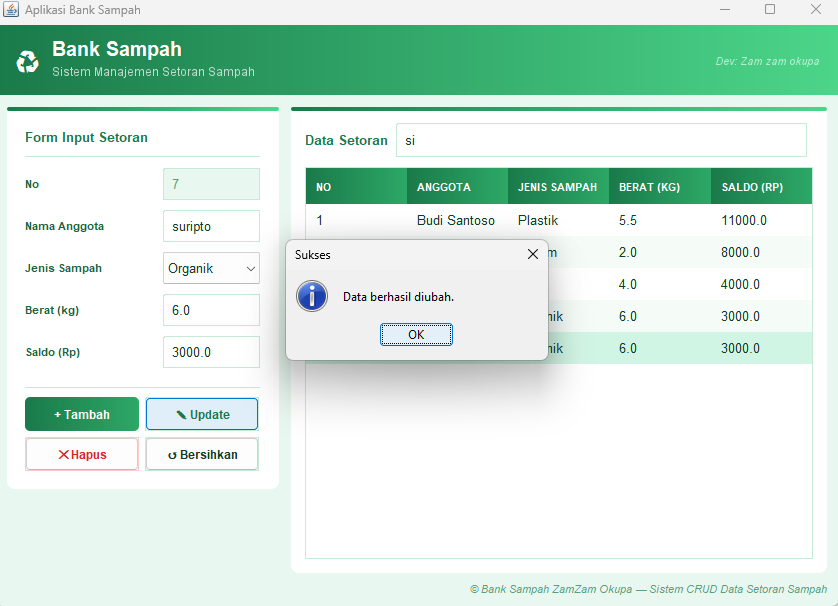

# 📸 Screenshots — Aplikasi Bank Sampah ZamZam Okupa

Folder ini berisi dokumentasi tampilan aplikasi **Bank Sampah ZamZam Okupa** berbasis Java Swing dengan tema modern linear-gradient hijau-putih.

---

## 🖼️ Daftar Screenshot

### 1. Tampilan Utama

> Tampilan awal aplikasi saat pertama dibuka. Menampilkan header gradient hijau, form input di sebelah kiri, dan tabel data setoran di sebelah kanan.

---

### 2. Form Input Data

> Form diisi dengan data anggota baru (Nama, Jenis Sampah, Berat, Saldo) sebelum ditambahkan ke database.

---

### 3. Notifikasi Sukses Tambah Data

> Dialog konfirmasi muncul setelah data berhasil ditambahkan ke database.

---

### 4. Data Berhasil Ditambahkan

> Tabel diperbarui otomatis menampilkan data baru (Kung Lao - Plastik) yang telah tersimpan.

---

### 5. Konfirmasi Hapus Data

> Dialog konfirmasi muncul sebelum data dihapus untuk mencegah penghapusan tidak disengaja.

---

### 6. Notifikasi Sukses Update Data

> Dialog sukses muncul setelah data berhasil diubah (nama anggota diperbarui menjadi "suripto").

---

### 7. Hasil Akhir Tabel

> Tampilan tabel setelah semua operasi CRUD dilakukan — data tersusun rapi dengan zebra striping hijau-putih.

---

## 🎨 Tema Tampilan

| Elemen | Warna |
|---|---|
| Header | Linear-gradient `#1a7a4a` → `#4cd68a` |
| Background | Hijau pucat `#e8f7ef` |
| Card / Panel | Putih `#ffffff` |
| Aksen border atas card | Gradient hijau |
| Header tabel | Gradient `#1a7a4a` → `#2da866` |
| Baris tabel (genap) | Putih |
| Baris tabel (ganjil) | `#f5fcf8` |
| Baris terpilih | `#d1f5e5` |
| Tombol Tambah | Gradient hijau (primary) |
| Tombol Hapus | Merah muda (danger) |

---

## 🛠️ Teknologi

- **Bahasa**: Java (JDK 11+)
- **GUI**: Java Swing
- **Database**: MySQL
- **IDE**: NetBeans
- **Dev**: Zam zam okupa
